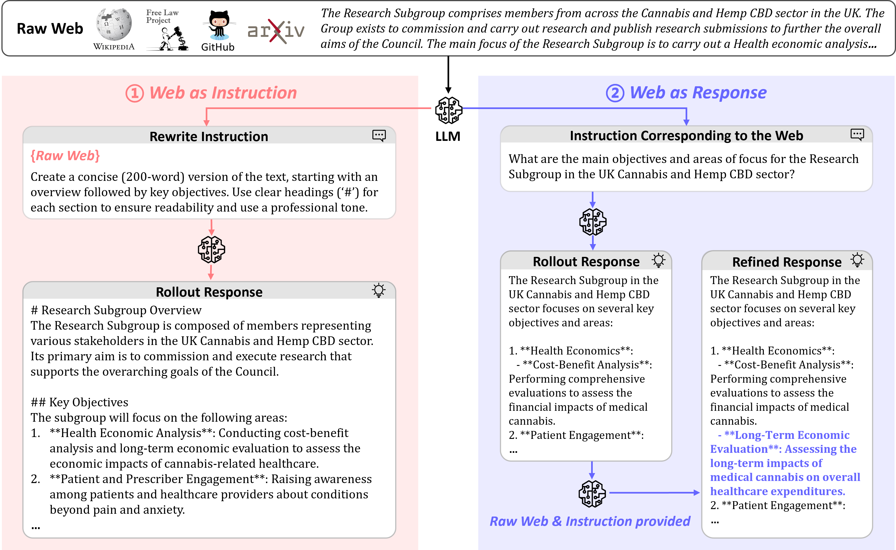

# Instruction-Tuning Data Synthesis from Scratch via Web Reconstruction

This repository contains code and instructions for synthesizing instruction-tuning datasets directly from raw web data and training large language models (LLMs) to improve instruction-following capabilities.

<p align="center">
    <br>
    
    <br>
</p>

Overview of the proposed **Web Reconstruction** (WebR) framework.
Leveraging an off-the-shelf LLM, WebR transforms raw web documents into high-quality instruction-response pairs.
It strategically assigns each document as either an instruction or a response to trigger the process of web reconstruction.

We released our generated datasets on Huggingface:
| **Dataset**    | **Generator** | **Size** |
|-------------------|--------------|--------------|
| WebR-Basic | Llama3-70B-Instruct | 100k |
| WebR-Pro | GPT-4o-mini | 100k |

## 1. Installation

### Step 1: Create a Python Environment
Set up a Python virtual environment using Conda (or another environment manager):
```bash
conda create -n webr python=3.10 && conda activate webr
```

### Step 2: Install PyTorch
Install PyTorch `v2.2.2`. The installation process depends on your hardware configuration. Follow the instructions on the official [PyTorch Installation Page](https://pytorch.org/get-started/locally/).

### Step 3: Install Required Packages
Install the remaining dependencies by running:
```bash
pip install -r requirements.txt
```

## 2. Instruction-Tuning Data Synthesis

### Organizing Input Data
To synthesize instruction-tuning data, organize your raw web documents in the following JSON format (see `web_en_1k.json` for examples):
```json
[
    {
        "webpage": "Credit unions must raise interest rates, says new report\nThe sector..."
    },
]
```

### Synthesizing Data
We provide scripts to synthesize instruction-tuning datasets from raw web data using different models. The synthesized output is saved in Parquet format.

- **Using GPT-4o-mini** (Need to specify the parameters of `API_KEY` and `BASE_URL`)
```bash
bash run_test_gpt_4o_mini.sh
```

- **Using Llama3-70B-Instruct**
```bash
bash run_test_llama3_70b.sh
```


## 3. Experiments

### 3.1 Training
Our training pipeline is based on the [alignment-handbook](https://github.com/huggingface/alignment-handbook) and was executed on 4 NVIDIA A800 GPUs, each with 80GB memory.

We performed instruction-tuning (IT) on Llama3-8B-base and Qwen2.5 models (1.5B, 3B, 7B, 14B variants) using various IT datasets. For example, training Llama3-8B-base took approximately 9 hours.

To ensure fairness across baselines, we used consistent hyperparameters and the official instruction templates for each model. The training settings are as follows:

| **Hyperparameter**    | **Value**                      |
|-------------------|----------------------------|
| Batch size        | 128                        |
| Learning rate     | 2e-5                       |
| Epochs            | 4                          |
| Max length        | 4096 (2048 for 14B LLMs)   |
| Optimizer         | AdamW                      |
| Scheduler         | Cosine                     |
| Weight decay      | 0                          |
| Warmup ratio      | 0.1                        |


### 3.2 Evaluation

#### Instruction-Following Benchmarks
We evaluated the fine-tuned models using four widely adopted instruction-following benchmarks:
- [AlpacaEval 2](https://github.com/tatsu-lab/alpaca_eval)
- [Arena-Hard](https://github.com/lmarena/arena-hard-auto)
- [MT-Bench](https://github.com/lm-sys/FastChat/tree/main/fastchat/llm_judge)
- [IFEval](https://github.com/google-research/google-research/tree/master/instruction_following_eval)

#### Downstream Task Evaluation
We further evaluated downstream performance on six diverse tasks, following the settings of [OpenCompass](https://opencompass.org.cn/):
- MMLU
- ARC
- WinoGrande
- MATH
- GSM8K
- HumanEval

## 📝 Citation
Please cite our paper if you find the repo helpful in your work:

```bibtex
@inproceedings{jiang2025dpobmc,
title={Bridging and Modeling Correlations in Pairwise Data for Direct Preference Optimization},
author={Jiang, Yuxin and Huang, bo and Wang, Yufei and Zeng Xingshan and Li, Liangyou and Wang, Yasheng and Jiang, Xin and Shang, Lifeng and Tang, Ruiming and Wang, Wei},
booktitle={The Thirteenth International Conference on Learning Representations},
year={2025},
url={https://openreview.net/forum?id=hRwxZmcvW9}
}
```
